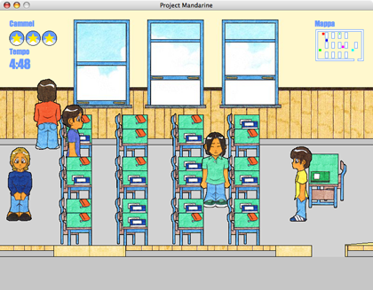

# project-mandarine-cocoa

A simple Cocoa + WebKit wrapper around the [Project Mandarine](https://github.com/emeraldion/project-mandarine) game.



# Usage

## Clone the repo

This repo depends on the [emeraldion/project-mandarine](https://github.com/emeraldion/project-mandarine) repo through a `git submodule`, therefore you must clone it recursively:

```bash
git clone --recursive git@github.com:emeraldion/project-mandarine-cocoa.git
```

## Build

Clone the repo and open the `Project Mandarine.xcodeproj` file in Xcode. Run and build.

# Binaries

A pre-built Project Mandarine binary is available for download on the [Emeraldion Lodge website](http://www.emeraldion.it/software/macosx/project_mandarine.html).

# License

Code is released under the [MIT](http://www.opensource.org/licenses/MIT) license.

Images and artwork are copyright (c) Claudio Procida 2002, 2008. All rights reserved.
